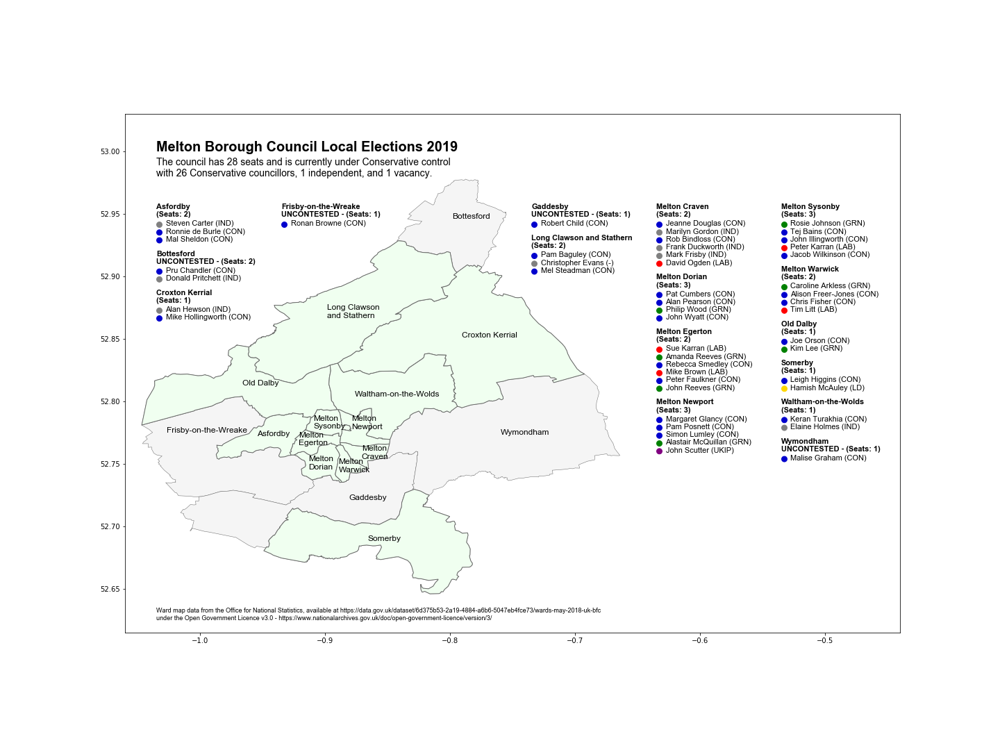
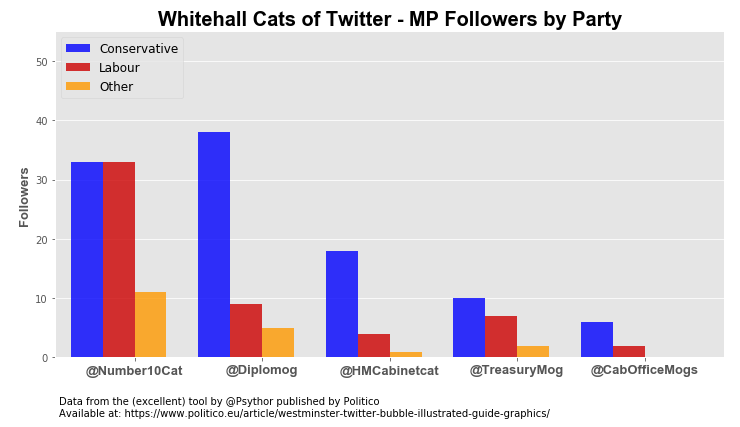
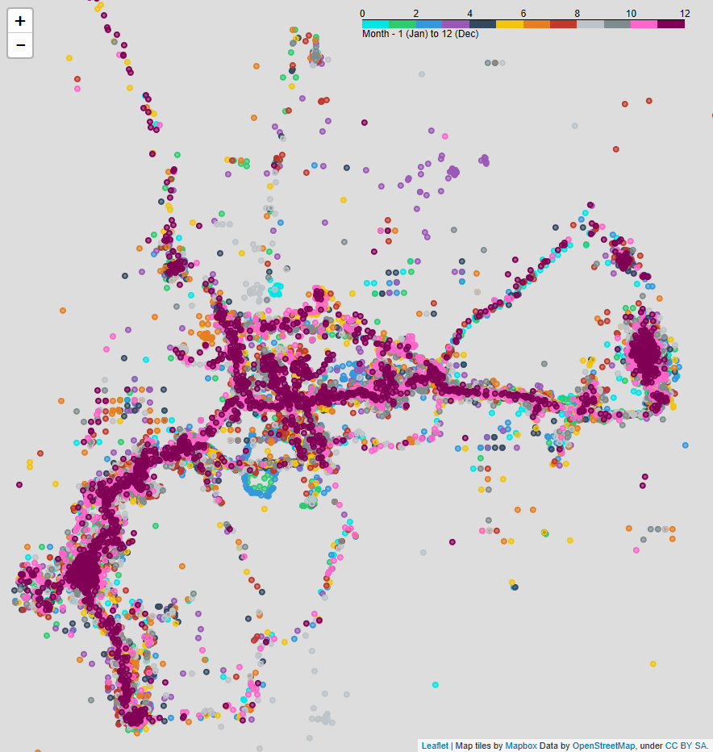
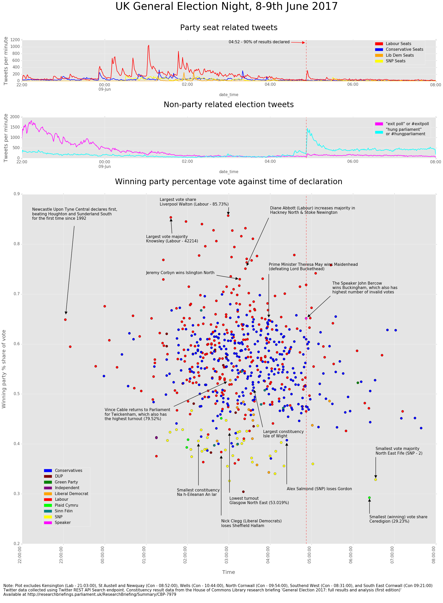
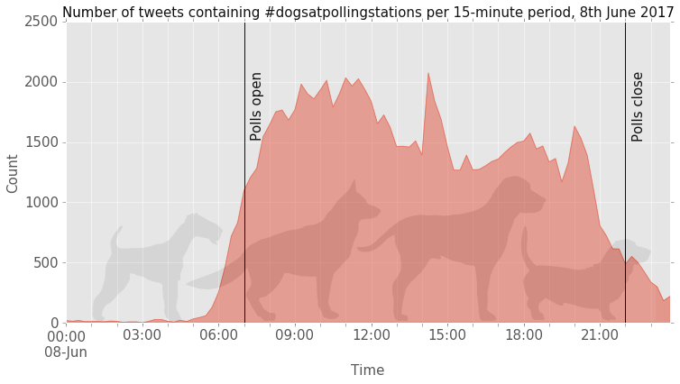

# data-doodles
A repository of little data experiments done in Jupyter notebooks for learning parts of the Python data analysis menagerie, which were first introduced to me the interesting OU module [TM351](http://www.open.ac.uk/courses/modules/tm351).

### Melton Mowbray Local Elections 2019 

More maps practice, a chart to show all of the candidates for the local Borough Council election and where each ward is:

### Politicats

Politico published an <a href="https://www.politico.eu/article/westminster-twitter-bubble-illustrated-guide-graphics/">interesting article about MPs Twitter bubbles</a>, with a tool which allowed 
you to see which MPs, broken down by party, followed any Twitter account. One of the visualisations showed the follower count of each of the accounts of the Whitehall cats. I love me some 
political cat Twitter, so naturally I had to know the split by party, and came up with this using data from the tool:

Who knew that Larry at Number 10 had an equal split of Labour and Tory MPs, whereas Palmerston at the Foreign and Commonwealth Office had far more Tories? Possibly because @Diplomog is the
only official one of the bunch, but who can tell!? <a href="https://www.politico.eu/article/politico-readers-tackle-the-westminster-twitter-bubble/">Politico seemed to like this one anyway</a>.

### Eerie Human Maps

A map showing only Google Maps data points logged by my phone in 2017, it's interesting and creepy how it forms a model of precisely how I moved around 
the town for a year (data not included in the notebook for obvious reasons!)

### Confetti (or: a timeline of UK General Election night 2017)
([Notebook here](https://github.com/LucyParry/data-doodles/blob/master/GE2017/Election%20Night/Election%20Night.ipynb)) Comparing [data published on 
election results for each seat](http://researchbriefings.parliament.uk/ResearchBriefing/Summary/CBP-7979) published by the House of Commons Library 
with counts of tweets with various related keywords, which were harvested using [Tweepy](http://tweepy.readthedocs.io/en/v3.5.0/): 

The spike in tweet numbers at around 4:50am was striking, and was very close to the point at which 90% of constituencies had declared according 
to the Commons Library report. Shortly before this point, the tweets about 'hung parliament' began to overtake those about 'exit poll' for the first time, 
suggesting that between 4am and 5am was when the realisation of what the result would actually be set in. Although counting tweets is simplistic, 
it was also interesting to see how there were consistently more tweets about Labour seats than Conservative ones through the night, despite there 
being more actual seats declared for the Conservatives as <a href="http://www.bbc.co.uk/news/blogs-trending-40209711">so much was made</a> of how Labour 
won social media.

Plotting the tweets against the actual declaration times was intriguing, but the 'high profile' declarations didn't really appear to correlate with 
spikes in tweets for the relevant party as I had thought they might. I couldn't identify any patterns in the declaration time compared with the party, 
or the percentage vote share either, but plotting the constituencies by party in this way revealed some interesting information, such as that the 
highest percentage vote shares (&gt; 70%) tended to be Labour, and in seats won by the Lib Dems and SNP, the share tended to be lower (&lt; 50%).

Picking out some of the 'extremes' was informative too; Buckingham for example is the constituency of The Speaker 
of the House of Commons, who stands independent of any party, and is traditionally not opposed in the constituency by any of the main parties. 
Furthermore, the Speaker does not vote in Parliament except to break ties, meaning that the people of the constituency essentially do not get 
the same representation as the rest of the country. This may explain why this constituency also had the largest number of invalid votes 
(<a href="http://www.independent.co.uk/news/uk/politics/john-bercow-speaker-house-commons-where-dont-votes-count-disenfranchisement-buckingham-constituency-a7739351.html">
as was also the case in 2015</a>), and it would be interesting to investigate whether the votes were deemed invalid as the electors had actively 
spoiled their ballots in protest, or were just confused as what their choices were. 

### Wildly speculating about what time of day people voted with the #dogsatpollingstations hashtag
([Notebook here](https://github.com/LucyParry/data-doodles/blob/master/GE2017/Dogs%20at%20Polling%20Stations/Dogs%20at%20Polling%20Stations.ipynb)) - 
A nice (and non party political) thing about UK general elections in recent years has been the
 [#dogsatpollingstations](https://twitter.com/search?q=%23dogsatpollingstations&src=tyah) hashtag on Twitter in which people post pictures of their faithful 
hounds outside the polling station when they go to vote. To try and learn how to work with Twitter data I used [Tweepy](http://tweepy.readthedocs.io/en/v3.5.0/)
 to grab tweets with the hashtag from UK General Election day and then plotted them  to see how the number of tweets varied across the day -

The vast majority of the tweets on the day were sent during polling hours (07:00 - 22:00), although there were probably more tweets <em>in general</em> between 
those two times. There appeared to be consistently more tweets in the first half of the polling hours (07:00 - 14:30) than in the second half  (14:31 - 22:00) 
and although it starts to reduce around 12:00, there's a spike at almost halfway at 14:15 (maybe a lot of retweeting in a short period?). In the evening, another 
spike can be seen at 20:00 (After-dinner / Eastenders dog walkers? People settling down in front of their devices for the evening?).

